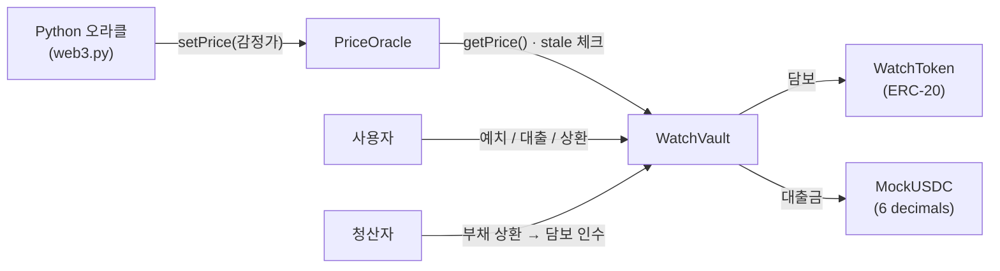
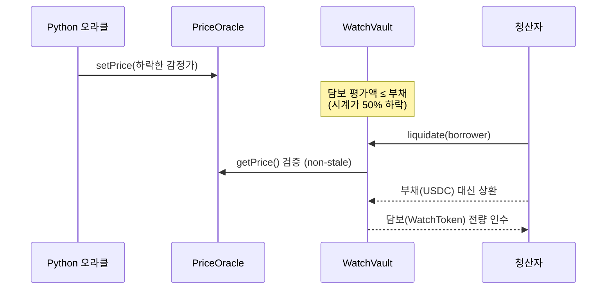

# Watch Tokenization — 시계 담보 대출 DeFi (라이트)

[](https://github.com/ParkJinhong/watchTokenization/actions/workflows/ci.yml)

실물 명품 시계를 **ERC-20으로 토큰화**하고, 그 토큰을 담보로 **USDC 대출 / 청산**을 제공하는 스마트컨트랙트 데모입니다. 시계 시세는 **Python 백엔드 오라클**이 온체인으로 푸시합니다.

> 명품 시계 거래 인프라 → 디지털 자산화(토큰화)·담보 금융으로 확장하는 사업 흐름을 가정한 포트폴리오 프로젝트입니다.

📄 **기획·리스크 분석 → [문서(HTML)](docs/시계토큰화_기획_리스크.html)** · 🗺️ **시스템 구조도 → [구조도(HTML)](docs/구조도.html)** (브라우저에서 열기 / Ctrl+P로 PDF 저장)

## 핵심 아이디어

| 질문 | 설계 |
|---|---|
| 시계를 어떻게 자산화하나 | 시계 1점 = `WatchToken`(ERC-20) 1,000 지분으로 분할. 컨디션 등급(S/A/B/C)을 온체인에 기록 |
| 왜 토큰을 사나 | 고가 시계를 통째로 못 사는 사람이 분할 매수 / 투자. 담보 대출 이자가 수익원이 됨 |
| 대출은 어떻게 | 시계 토큰을 담보로 **감정가의 50%(LTV)**까지 USDC 대출 |
| 청산은 언제 | 시세 하락으로 **담보 평가액 ≤ 부채**(= 시계가가 대출시점의 50% 이하)가 되면 누구나 청산 |
| 시세는 어디서 | 오프체인 감정가를 **Python 오라클(`oracle.py`)**이 `PriceOracle`에 주기적으로 푸시 |

## 아키텍처



### 청산 흐름



## 컨트랙트

| 컨트랙트 | 역할 |
|---|---|
| `WatchToken.sol` | 시계 분할 지분 ERC-20. 등급/식별자 보관 |
| `MockUSDC.sol` | 데모용 스테이블코인 (실제 USDC처럼 6 decimals) |
| `PriceOracle.sol` | updater 전용 가격 푸시 + staleness(만료) 검증 |
| `WatchVault.sol` | 담보 예치·대출·상환·청산, LTV/이자 로직 |

설계 메모
- **오라클 staleness**: 오래된 가격은 `getPrice`가 revert → 잘못된 시세로 대출/청산되는 사고 방지
- **청산 임계 LTV 100%**: 공고/기획의 "가격 50% 이하 시 청산"을 그대로 반영. (실무에선 보통 안전 버퍼를 둬 더 일찍 청산)
- **소수점**: 담보 18dp · USDC 6dp 혼용을 의도적으로 다뤄 실수 잦은 단위 변환을 검증
- **보안**: `ReentrancyGuard`, `SafeERC20`, custom error, 권한 분리(`onlyOwner`/`onlyUpdater`)

## 실행

### 1. 설치

```bash
npm install
python -m pip install -r oracle/requirements.txt
cp .env.example .env
```

### 2. 컴파일 & 테스트

```bash
npm run compile
npm test
```

### 3. 로컬 엔드투엔드

```bash
# 터미널 A — 로컬 체인
npx hardhat node

# 터미널 B — 배포 (deployments.json 생성)
npm run deploy:local

# 터미널 C — 시세 오라클 푸시 시작
python oracle/oracle.py
```

오라클이 랜덤워크로 시세를 떨어뜨리다 보면 담보 평가액이 부채 아래로 내려가고, 그 시점부터 `vault.isLiquidatable(borrower)` 가 `true`가 되어 청산이 가능해집니다. 실제 시세 API 연동은 `oracle.py`의 `fetch_price()`만 교체하면 됩니다.

## 테스트 커버리지

- 토큰화: 등급/식별자/발행량
- 대출: 50% 한도 / 초과 시 revert
- 청산: 가격 하락 → 청산 가능 전환 / 청산 실행 / 건전 포지션 청산 거부
- 이자: 시간 경과 누적 / 상환
- 오라클 예외: stale 가격, 0 가격, 권한 없는 updater

## 기술 스택

Solidity 0.8.24 · Hardhat · TypeScript · Ethers.js v6 · OpenZeppelin · Python(web3.py)

## 한계 / 다음 단계 (의도적 범위 제한)

라이트 버전이라 다음은 제외했습니다 — 확장 로드맵으로 문서화:
- 미니 AMM(분할 토큰 2차 거래 + 청산 매각 시장)
- 수익 분배(`RevenueDistributor`, 대여수익/이자 pull-claim)
- 다중 시계/금고 관리(Factory), 부분 청산, 복리 이자
